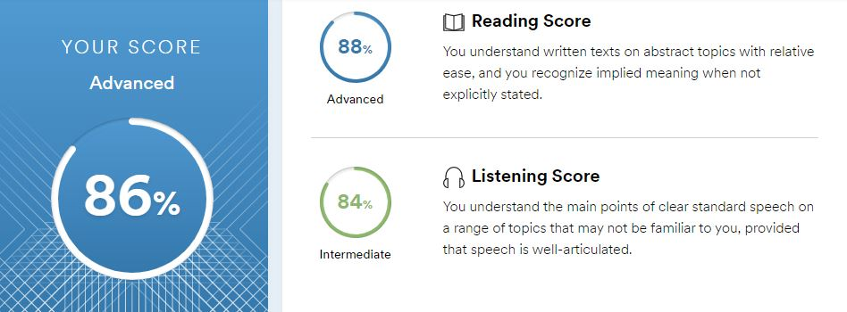

# Anna Zhukova
## Frontend Developer

---

### Contact information:

**Phone:** +7 912 018-87-80<br/>
**E-mail:** anna.zhukanna@gmail.com<br/>
**Telegram:** [@zhukanny](https://t.me/zhukanny)<br/>
**LinkedIn:** [LinkedIn](https://www.linkedin.com/in/anna-zhukova-37643aa3/)

---

### About Me:

I am a frontend developer and looking for my first full-time job. I made my first website in 2014 and since that I have been learning web development. I created websites on СMS and simple landing pages as a freelancer.<br/>
In recent years, I have decided to delve deeper into Javascript and its frameworks. I am ready to apply my skills in work, learn new things and share my knowledges.

---

### Skills:

- HTML5, CSS3 (BEM, SCSS);
- JavaScript (ES6+), RestAPI;
- React (React Router, React Hooks), Redux;
- Webpack, git, npm;

---

### Code example:

#### Telephone Number Validator
*Return `true` if the passed string looks like a valid US phone number.<br/>
The user may fill out the form field any way they choose as long as it has the format of a valid US number. The following are examples of valid formats for US numbers (refer to the tests below for other variants):*
> 555-555-5555<br/>
> (555)555-5555<br/>
> (555) 555-5555<br/>
> 555 555 5555<br/>
> 5555555555<br/>
> 1 555 555 5555

*Your job is to validate or reject the US phone number based on any combination of the formats provided above. The area code is required. If the country code is provided, you must confirm that the country code is 1. Return `true` if the string is a valid US phone number; otherwise return `false`.*

```javascript
function telephoneCheck(str) {
    let reg = /^1?\s?((\(\d{3}\))|\d{3})(-|\s)?\d{3}(-|\s)?\d{4}$/;

  return reg.test(str);
}
```

---

### Education:

2021 **Basics of Frontend-development** *Innopolis University*<br/>
2021 **[JavaScript Algorithms and Data Structures](https://www.freecodecamp.org/certification/fcc2afb3d26-aec2-46c2-a602-3ac57c72a23e/javascript-algorithms-and-data-structures)** *Freecodecamp*<br/>
2020 **Economics** *Chelyabinsk State University*

---

### Languages:

- English \- *Advanced (according to the online test at [www.efset.org](https://www.efset.org/quick-check))*
- Russian \- *Native*

